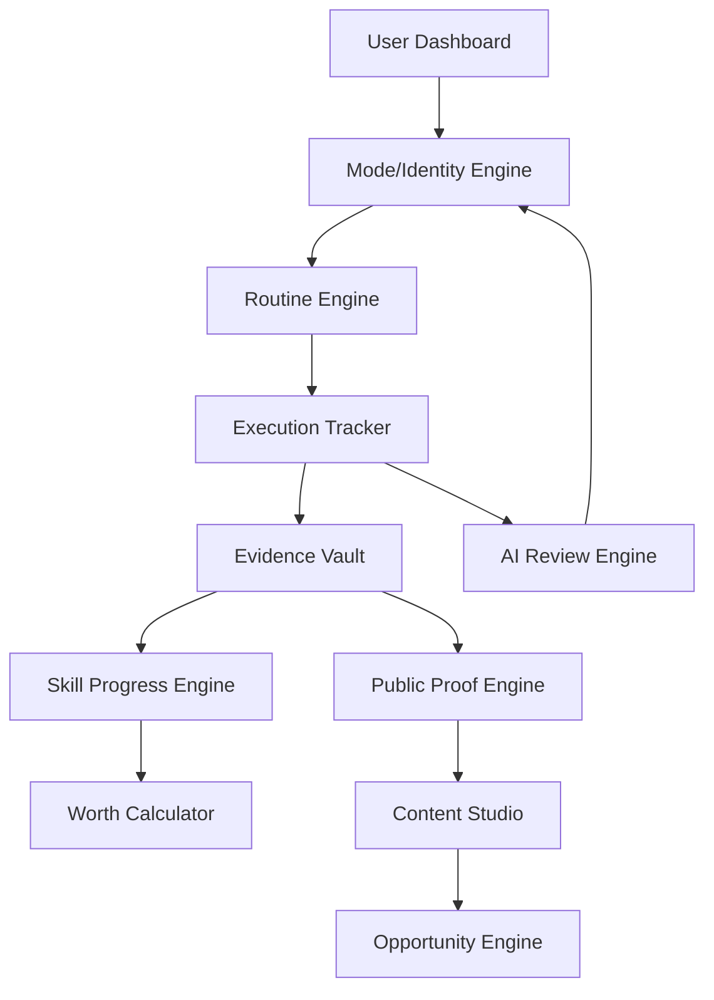

# Engineer OS: System Architecture

## High-Level Overview
Engineer OS is built as a modular "Meta-App" where specialized engines interact through a central event-driven state.

## Technical Stack
- **Frontend**: Next.js 14 (App Router), React, Lucide Icons.
- **Backend**: Next.js Server Actions, Node.js.
- **Database**: PostgreSQL (via Prisma ORM).
- **AI**: OpenAI GPT-4o (Reasoning), Whisper (Speech-to-Text), Embeddings (Search).
- **Styling**: Vanilla CSS with modern features (CSS Variables, `@layer`, Container Queries).

## Key Components
### 1. Identity & Mode Engine
Handles the "Who am I today?" logic. Adjusts weights for Student, Engineer, Founder, etc.

### 2. Evidence Vault
The "Source of Truth". Every commit, blog post, and project demo is stored here with metadata.

### 3. AI Review Engine
The "Strict Mentor". Analyzes daily logs and provides sharp, no-nonsense feedback.
